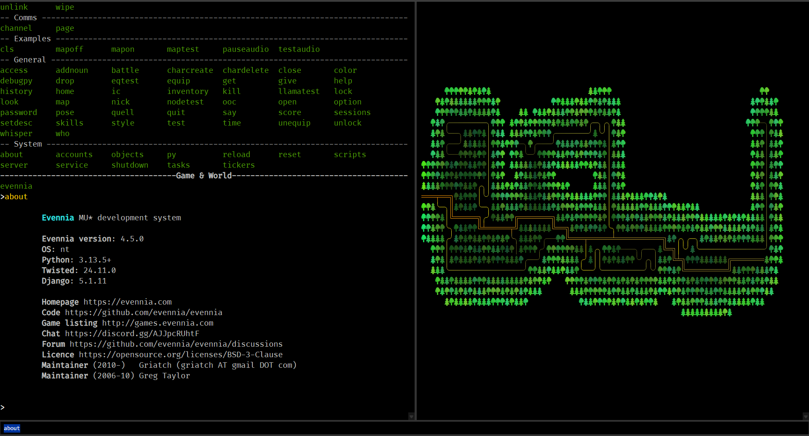

## xtermia2, an xterm.js webclient for Evennia
This replaces the webclient of an [Evennia](https://github.com/evennia/evennia/tree/main) game with the [xterm.js](https://github.com/xtermjs/xterm.js) terminal emulator.
This is a demo that you can copy over a freshly initialized Evennia game.

### Features
- Really fast. Rendering is GPU accelerated, full screen animations are feasible.
- Optional persistent map display
    - send 'map' command to webclient with your map to update the cached map
    - map will be centered in right terminal
    - map legend (if any) will be centered separately
	- map can be enabled/disabled/updated at will
    - terminal divider can be adjusted and map will be resized
    - (see [examples.py](commands/examples.py))
- Up/down arrow to scroll through command history
- You can hold Enter to spam commands now or type anything else to overwrite last command
- Clickable web links
- Completion suggestions based on command history and Evennia commands available at login
- Client side options for font size, screenreader, etc. enter :help for a command list
- Won't echo commands or add to command history until after login (won't echo password)
- Sound/music (see [examples.py](commands/examples.py))
- All files are local, no internet required
- Uses [Fira Code](https://github.com/tonsky/FiraCode) font because it has great box drawing characters

### Todo
- Recording (and playback at terminoid.com)
- TUI stuff? maybe.

### Installation for a fresh game
Copy this repo's entire folder structure to your Evennia "mygame" game folder.

Note: 
- /server/conf/settings.py ***Will be overwritten***
- /server/conf/inputfuncs.py ***Will be overwritten***
- /typeclasses/characters.py ***Will be overwritten***
- /commands/default_cmdsets.py ***Will be overwritten***

### Installation for an existing game
Back up your existing game folder.
Copy this repo's entire folder structure to your Evennia "mygame" game folder and 
Check the files above and merge the needed code with your own.

Add settings from [settings.py](/server/conf/settings.py) to your own settings.py.

Look at [characters.py](/typeclasses/characters.py) for command completion and map example, add what you want to yours.

### File sources
- Uses "CACHE BUSTERRRR" from https://github.com/InspectorCaracal/evelite-client/tree/main
- addon-fit.js = npm install @xterm/addon-fit@beta
- addon-unicode11.js = npm install @xterm/addon-unicode11@beta
- addon-webgl.js = npm install @xterm/addon-webgl@beta
- FiraCode = https://github.com/tonsky/FiraCode
- webclient.py = https://github.com/evennia/evennia/blob/main/evennia/server/portal/webclient.py
- xterm.css = npm install @xterm/xterm@beta
- xterm.js = ""
- fontfaceobserver.js = https://github.com/bramstein/fontfaceobserver/blob/master/fontfaceobserver.js